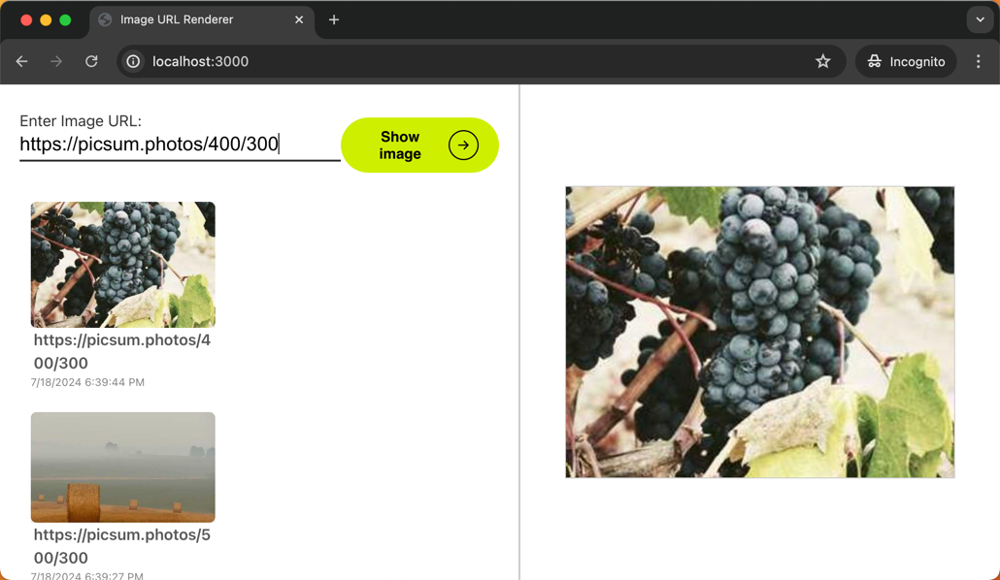
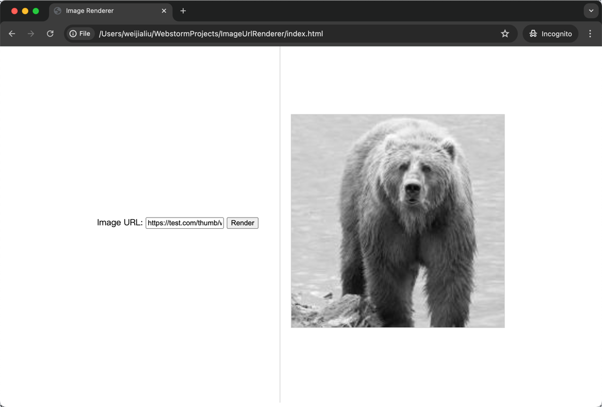

# Project: Image Url Renderer

## Update

### Version 2.0 (Released on 2024-07-18)

- **New Website Design:** The project has been updated with a new version of the website featuring a fresh design.
- **Project History:** A history of the project has been added, which is stored in local storage. 
- **Gratitude:** I am grateful for the beautiful styles provided for free. I appreciate being able to use them.
  - [URL text input](https://uiverse.io/Satwinder04/pink-bat-77)
  - [Do renderer button](https://uiverse.io/alexmaracinaru/perfect-panda-77)
  - [Image Card](https://uiverse.io/alexmaracinaru/purple-zebra-61)

### Version 1.0 (Released on 2024-07-17)

- This was the first version of the project, which introduced the core functionality of rendering images from URLs.

